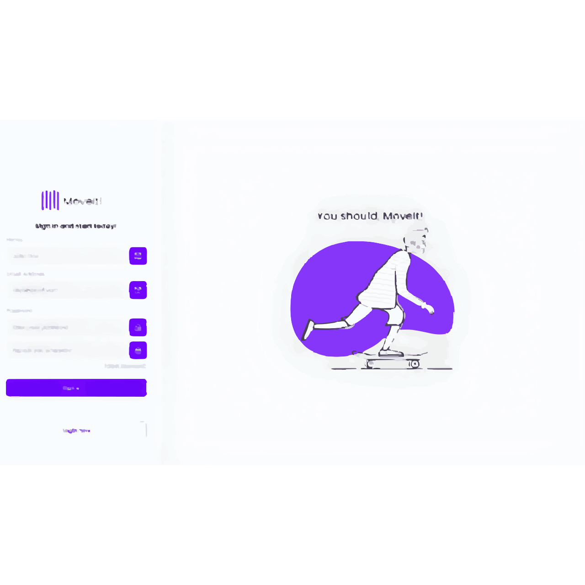

[TYPESCRIPT__BADGE]: https://img.shields.io/badge/typescript-D4FAFF?style=for-the-badge&logo=typescript
[ANGULAR__BADGE]: https://img.shields.io/badge/Angular-red?style=for-the-badge&logo=angular

<h1 align="center" style="font-weight: bold;">Exemplo de página de login em Angular 💻</h1>

![angular][ANGULAR__BADGE]
![typescript][TYPESCRIPT__BADGE]

<p align="center">
 <a href="#about">Sobre</a> • 
 <a href="#started">Primeiros passos</a> • 
  <a href="#started">App Routes</a> • 
  <a href="#colab">Collaborators</a> •
 <a href="#contribute">Contribute</a>
</p>


<p align="center">
    
</p>

<h2 id="started">📌 Sobre</h2>

Este projeto é um aplicativo simples de login e inscrição desenvolvido para demonstrar como criar aplicativos Angular com autenticação e integração com back-end.

<h2 id="started">🚀 Primeiros passos</h2>

Aqui você descreve como executar seu projeto localmente

<h3>Pre requisitos</h3>

Aqui você lista todos os pré-requisitos necessários para execução do seu projeto. Por exemplo:

- [NodeJS](https://github.com/)
- [Git 2](https://github.com)
- [Angular CLI](https://angular.io/cli)

<h3>Clone</h3>

Como clonar o projeto.

```bash
git clone https://github.com/Phillipag2022/login-page.git
```

<h3>Iniciando o projeto</h3>

Como iniciar o projeto.

```bash
cd project-name
npm run start
```

<h2 id="routes">📍 Rotas de aplicação</h2>

Aqui você pode listar as principais rotas da sua API e quais são os corpos de solicitação esperados.​
​
| rotas              | descrição                                         
|----------------------|-----------------------------------------------------
| <kbd>/signup</kbd>     | Page to sign up
| <kbd>/login</kbd>     | Page to login
| <kbd>/user</kbd>     | Protected page that only logged in users can access

